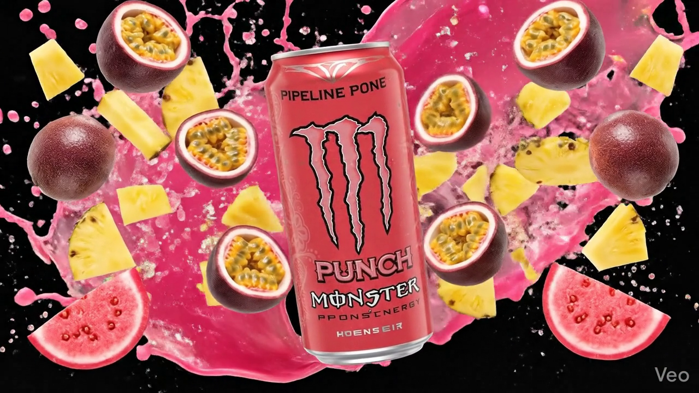

# Monster Energy | Animated Fan Concept

This is a beautiful, scrollytelling fan-made website for Monster Energy!  
**⚡ My first animated website built using Antigravity!**

## Features
- **Scrollytelling Animations:** Frame-by-frame HTML5 Canvas sequence locked to scroll.
- **Cinematic GSAP Transitions:** Smooth crossfades, content reveals, and bar chart animations.
- **Web Audio API Visualizer:** A custom 64-bar symmetric audio visualizer that reacts in real-time to the frequency of the music playing on the bottom audio bar.
- **Flavor Switching:** Dynamic CSS variables that seamlessly transition glow effects and imagery based on the active tab context.

*Note: This is an unofficial, non-profit fan project. Monster Energy is a registered trademark of Monster Energy Company.*
